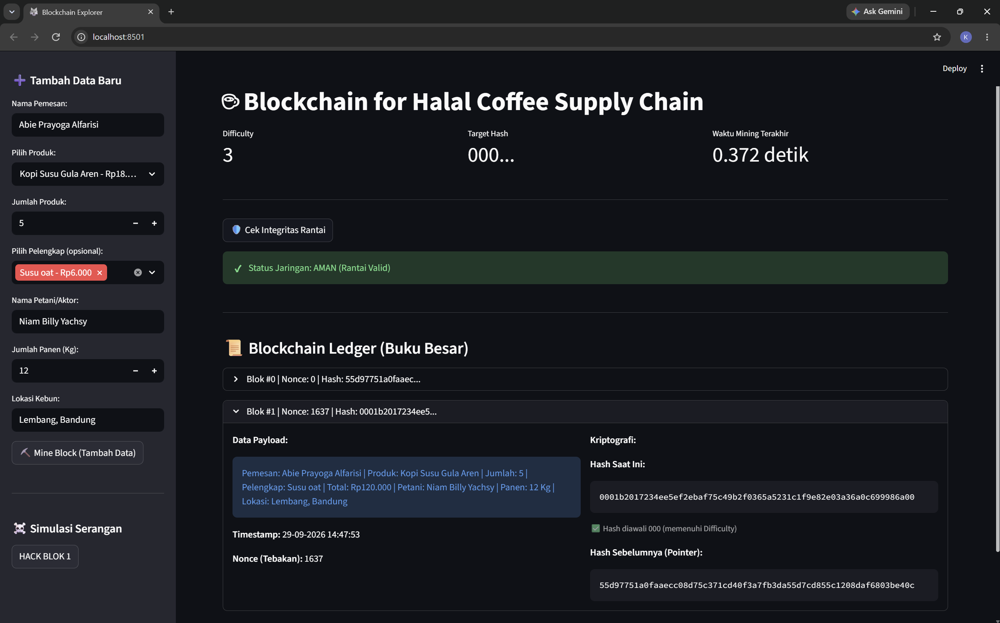
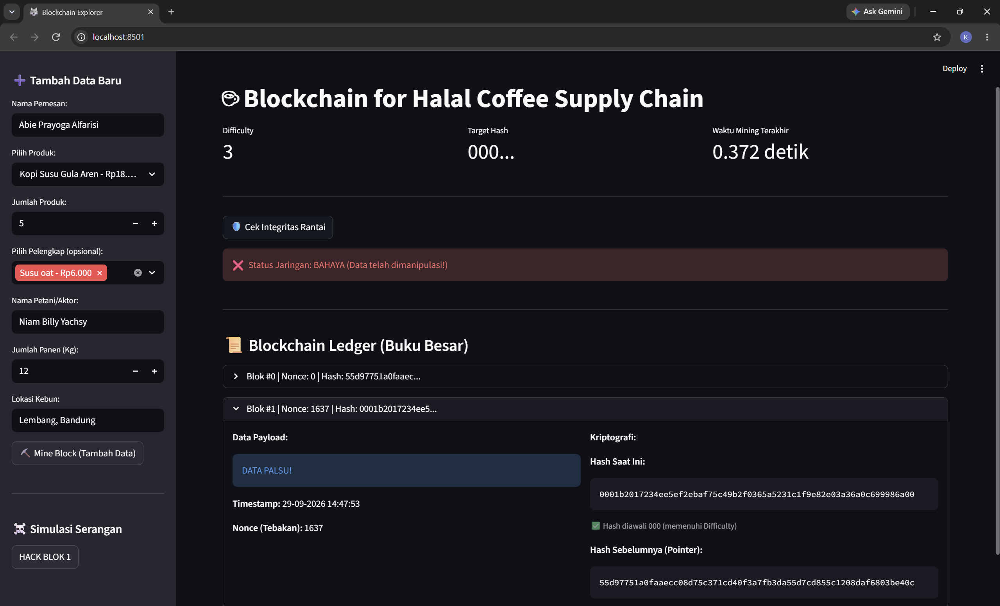

# LAPORAN PRAKTIKUM

## Implementasi Blockchain Sederhana untuk Pencatatan Rantai Pasok Kopi

**Mata kuliah:** Blockchain  
**Nama:** Abie Prayoga Alfarisi 
**NIM:** 2530801023  
**Kelas:** INFORMATIKA 3D 

## 1. Abstrak

Praktikum ini membahas implementasi blockchain sederhana menggunakan Python dan Streamlit. Program mencatat transaksi produk kopi beserta informasi pemesan dan rantai pasoknya ke dalam blok. Setiap blok menggunakan hash SHA-256, terhubung dengan hash blok sebelumnya, dan ditambang dengan mekanisme Proof of Work (PoW). Antarmuka juga menyediakan pemeriksaan integritas dan simulasi perubahan data. Pengujian kode inti menunjukkan bahwa blok yang ditambang dinyatakan valid dan manipulasi payload dapat dideteksi.

## 2. Tujuan

1. Memahami hubungan antarblok melalui hash dan `previous_hash`.
2. Menerapkan hash SHA-256 dan Proof of Work sederhana.
3. Mencatat transaksi produk serta informasi petani, panen, dan lokasi kebun.
4. Menguji validitas rantai dan mengamati deteksi manipulasi data.

## 3. Dasar Teori

Blockchain adalah kumpulan blok yang disusun berurutan. Blok menyimpan hash yang dihitung dari isi blok dan hash blok sebelumnya. Perubahan isi akan menghasilkan hash berbeda, sehingga pemeriksaan terhadap hash dan tautan antarblok dapat mengungkap perubahan yang tidak diikuti pembaruan rantai.

Proof of Work pada program ini mencoba nilai `nonce` secara berurutan dan menghitung ulang hash sampai hash diawali sejumlah nol sesuai tingkat kesulitan. Tingkat kesulitan aplikasi ditetapkan sebesar 3, sehingga target hash memiliki awalan `000`. Mekanisme ini merupakan simulasi pembelajaran dan bukan implementasi konsensus jaringan blockchain produksi.

## 4. Alat dan Bahan

- Python 3
- Pustaka Streamlit
- Modul standar Python: `hashlib`, `time`, dan `datetime`
- Berkas program `core.py` dan `app.py`
- Visual Studio Code atau editor kode sejenis

## 5. Perancangan dan Alur Program

### 5.1 Struktur blok (`core.py`)

Kelas `Block` menyimpan indeks, timestamp, data transaksi, `previous_hash`, `nonce`, dan `hash`. Timestamp dibuat menggunakan `time.time()`. Metode `calculate_hash()` menghitung SHA-256 dari gabungan indeks, timestamp, data, hash sebelumnya, dan nonce. Nilai nonce dimulai dari 0.

Metode `mine_block()` menambah nonce dan menghitung ulang hash hingga memenuhi target awalan nol. Setiap percobaan yang belum memenuhi target dicetak ke terminal. Hash blok yang berhasil ditambang tersimpan pada atribut `hash`.

### 5.2 Pengelolaan rantai (`core.py`)

Kelas `Blockchain` memulai rantai dengan genesis block berindeks 0. Saat blok baru ditambahkan, `add_block()` mengisi `previous_hash` dengan hash blok terakhir, menjalankan proses mining, lalu menambahkan blok tersebut ke rantai. Metode `is_chain_valid()` memeriksa apakah hash setiap blok setelah genesis sesuai dengan isi bloknya dan apakah `previous_hash` menunjuk ke hash blok sebelumnya.

### 5.3 Antarmuka dan data transaksi (`app.py`)

Antarmuka Streamlit menampilkan katalog tujuh produk kopi/minuman dan tujuh pilihan pelengkap, termasuk pelengkap gratis berupa es batu tambahan. Total harga dihitung dengan rumus:

```text
total harga = (harga produk + jumlah harga pelengkap) x jumlah produk
```

Data transaksi yang dimasukkan ke blok meliputi nama pemesan, produk, jumlah produk, pelengkap, total harga, nama petani/aktor, jumlah panen dalam kilogram, dan lokasi kebun. Nama pemesan, petani/aktor, serta lokasi wajib diisi sebelum blok dapat ditambahkan. Rantai dan waktu mining terakhir disimpan dalam `st.session_state` selama sesi Streamlit berlangsung.

Ledger menampilkan payload, timestamp, nonce, hash saat ini, dan hash sebelumnya. Aplikasi juga menampilkan tingkat kesulitan serta waktu mining terakhir. Tombol **HACK BLOK 1** mengubah data blok pertama setelah genesis menjadi `DATA PALSU!`, sementara tombol **Cek Integritas Rantai** menjalankan validasi dan menampilkan status aman atau bahaya.

## 6. Langkah Menjalankan Program

Jalankan perintah berikut dari folder praktikum:

```powershell
python -m pip install streamlit
streamlit run app.py
```

Kemudian buka alamat lokal yang ditampilkan Streamlit pada terminal.

## 7. Pengujian dan Hasil

Pemeriksaan sintaks dijalankan dengan `python -m py_compile core.py app.py` dan berhasil tanpa kesalahan. Uji fungsional kode inti dilakukan dengan membuat blockchain, mengatur tingkat kesulitan menjadi 1 agar pengujian singkat, lalu menambahkan satu blok. Validasi mengembalikan nilai benar setelah mining. Setelah payload blok diubah secara langsung, validasi mengembalikan nilai salah. Dengan demikian, uji tersebut membuktikan proses penambahan blok dan deteksi perubahan payload.

Pada aplikasi, alur yang dapat diuji secara manual adalah mengisi data transaksi dan rantai pasok, menekan **Mine Block (Tambah Data)**, memeriksa informasi blok di ledger, lalu menekan **Cek Integritas Rantai**. Simulasi serangan dapat dilakukan setelah ada minimal satu blok selain genesis dengan menekan **HACK BLOK 1**; pemeriksaan integritas berikutnya seharusnya menunjukkan status bahaya.

## 8. Kesimpulan

Program membentuk rantai blok untuk mencatat pesanan produk kopi dan informasi rantai pasok. Hash SHA-256 mengikat data setiap blok, `previous_hash` menghubungkan blok secara berurutan, dan Proof of Work mencari hash dengan awalan sesuai tingkat kesulitan. Uji fungsional kode inti berhasil menunjukkan bahwa perubahan data setelah blok ditambang terdeteksi oleh validasi.

## 9. Batasan dan Saran Pengembangan

- Data blockchain hanya disimpan pada memori sesi aplikasi dan tidak bertahan sebagai penyimpanan permanen.
- Program belum menggunakan jaringan peer-to-peer, konsensus antarnode, tanda tangan digital, atau autentikasi aktor rantai pasok. Karena itu, pencatatan petani dan lokasi belum membuktikan keaslian informasi.
- Validasi memeriksa hash dan tautan blok setelah genesis, tetapi tidak memvalidasi ulang target Proof of Work semua blok maupun integritas genesis block.
- Tingkat kesulitan belum disesuaikan secara dinamis, dan proses mining mencetak setiap percobaan ke terminal.
- Pengembangan berikutnya dapat menambahkan penyimpanan permanen, validasi PoW menyeluruh, autentikasi dan tanda tangan digital, serta pengujian antarmuka otomatis.

Laporan Keberhasilan


