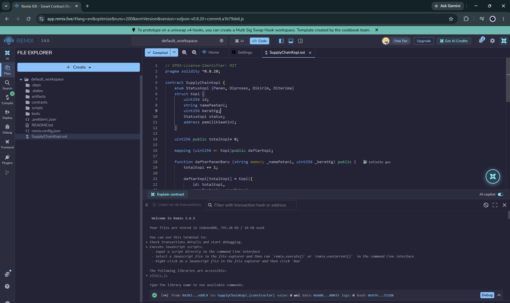
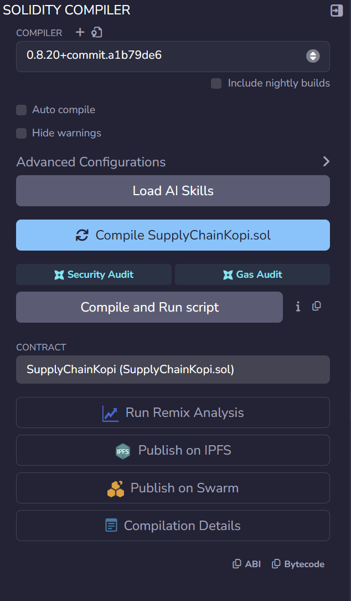
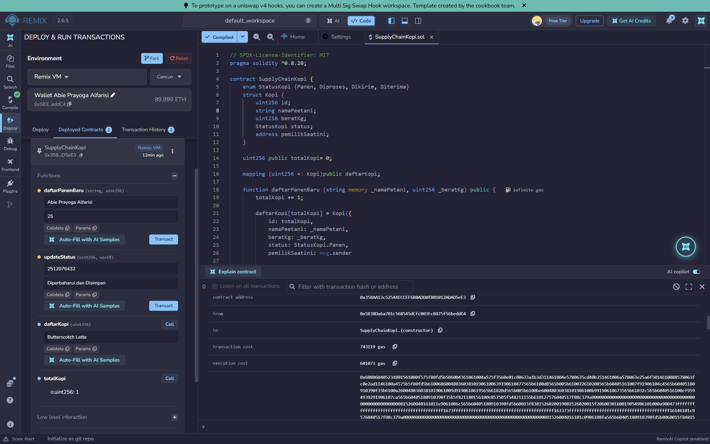
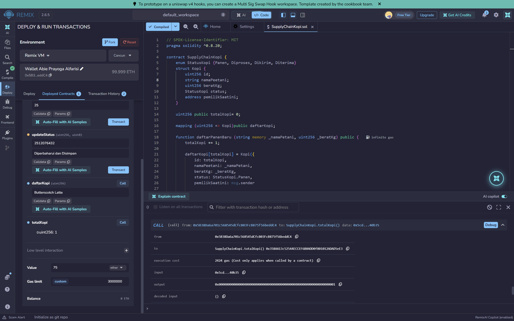
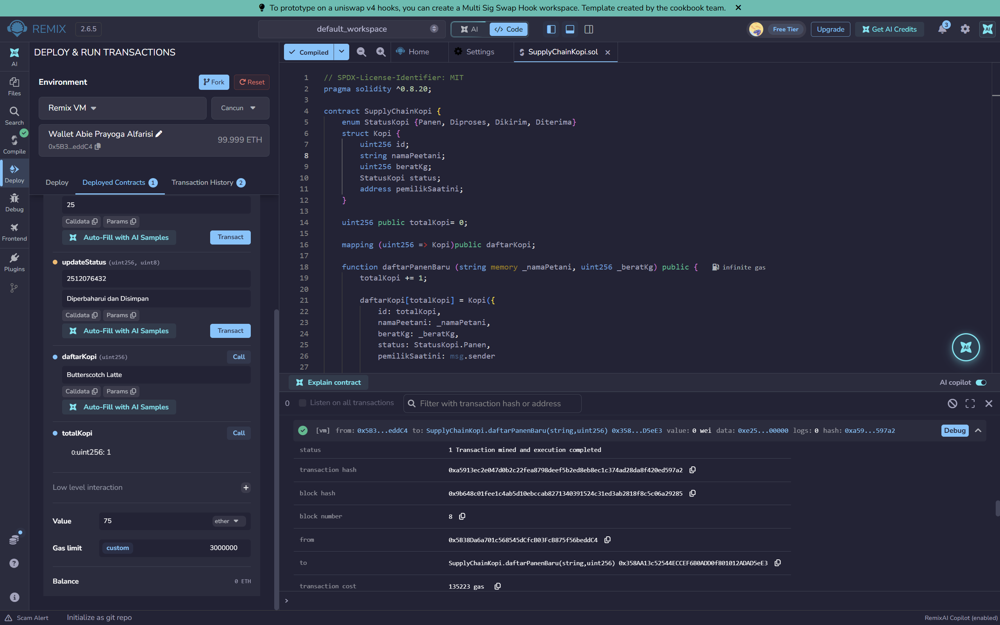
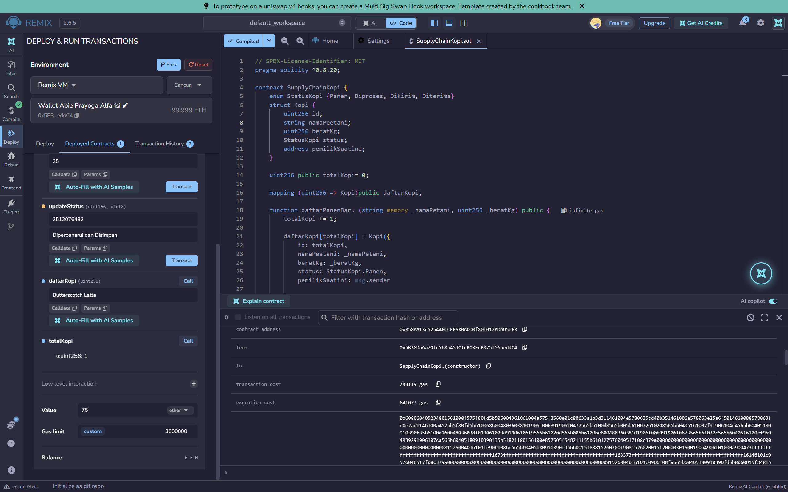

# Praktikum 6: Membuat Smart Contract dengan Solidity di Remix #

## Tujuan Pembelajaran
Setelah menyelesaikan praktikum ini, mahasiswa diharapkan mampu:
1. Memahami konsep dasar dari smart contract pada blockchain.
2. Menggunakan platform Remix untuk menulis, mengompilasi, dan men-deploy smart contract berbasis Solidity.
3. Mengimplementasikan fungsionalitas dasar smart contract yang melibatkan state variable dan fungsi.
4. Melakukan interaksi dengan smart contract yang sudah ter-deploy melalui Remix.

### Proses Praktikum ###

1. Buka [Remix IDE](https://ethereum.org) login via Gmail, bukti:

2. Create a New file di files dengan nama file SupplyChainKopi.sol isi koding sesuai dengan modul

3. Lakukan kompilasi dengan menekan tombol disamping kiri

4. Deploy Smart Contract to Own Blockchain

